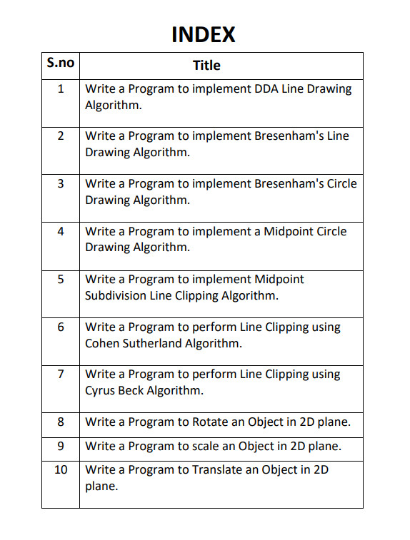

# Comuter Graphic and Multimedia application LAB FILE
This Repository contains my code for BCA Semester 4 Subject CGMA's LAB FILE.

All the codes are tested and are working.

Repo contain some additional code.

<p align="center">
  
</p>


# Graphics library setup 

## Quick setup

```bash
git clone https://github.com/ullaskunder3/graphics.h-project-template.git
```

Detail setup can be found on my other repo [solution-to-graphics.h](https://github.com/sagargoswami2001/How-to-Setup-Graphics.h-for-Visual-Studio-Code/blob/main/README.md)

Article by [sagargoswami2001](https://github.com/sagargoswami2001)

## My directory look like

```cmd
  D:.
├───.vscode
└───Home
    ├───build
    └───src
```

- Just `Ctrl+Shift+B` to run the build task you will get the executable file in build folder

## !mportant

- Folder `src` contains source code

- Folder `build` where compiler generate .exe

- .vscode contains c_cpp_properties.json and task require modification according to your environment and types compiler
